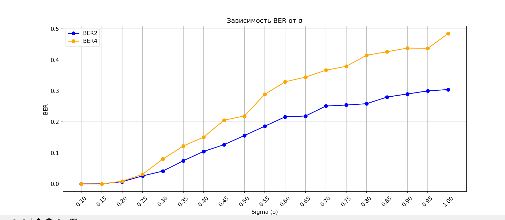

Отчет по РГР

Вариант 5

Выполнил:
студент гр. ИА-232
Гурачевский Никита
GitHub: https://github.com/Gu-Master/rgr

1. Цель работы

Закрепить и структурировать знания, полученные в рамках изучения  дисциплины «Основы систем мобильной связи».
GURACHEVSKII NIKITA
2 - 3) . Ввод данных
Начнем с преобразования имени и фамилии в битовую последовательность.

4) Добавил последовательность Голда

5) Преобразовал биты с данными во временные отсчеты сигналов,  так чтобы на каждый бит приходилось N-отсчетов. Результат: массив длиной  Nx(L+M+G) нулей и единиц – но это уже временные отсчеты сигнала (пример  амплитудной модуляции).

6) Создал нулевой массив длиной 2хNx(L+M+G). Ввел с  клавиатуры число от 0 до Nx(L+M+G) и в соответствие с введенным  значением вставил в него массив значений из п.5. Результат – массив Signal – визуализировал на графике.

7) Проходя через канал  отсчеты сигнала исказились – к ним добавились значения шумов,  присутствовавших в канале, которые можно получить, используя нормальный  закон распределения с μ=0 и σ – вводится с клавиатуры (float). Cформировал массив с шумом размером 2хNx(L+M+G), реализовав его с помощью нормального распределения, например,

Затем поэлементно сложил информационный сигнал с  полученным шумом. Визуализировал массив отсчетов зашумленного принятого сигнала.

8) Реализовал функцию корреляционного приема и определил, начиная  с какого отсчета (семпла) начинается синхросигнал в полученном  массиве, удалил лишние биты до этого массива, выведите значение  в терминал. Результат: функция корреляционного приемника.

9) Зная длительность в отсчетах N каждого символа, разобрал  оставшиеся символы. Накопил по N отсчетов и сравнивайте их  с пороговым значением P (подумайте, какое значение порога следует  выбрать, чтобы интерпретировать полученные семплы нулями или  единицами). Написал функцию, которая будет принимать решение  по каждым N отсчетам – 0 передавался или 1, на выходе которой  должно быть (L+M+G) битов данных.

10) Удалите из полученного массива G-бит последовательности  синхронизации.

11) Проверьте корректность приема бит, посчитав CRC. Выведите в  терминал информацию о факте наличия или отсутствия ошибки
    .

12) Если ошибок в данных нет, то удалить биты CRC и оставшиеся  данные подайте на ASCII-декодер, чтобы восстановить посимвольно  текст. Выведите результат на экран.

13) 

Заключение В ходе работы была успешно смоделирована передача данных с использованием битовых последовательностей, методов проверки целостности и синхронизации. Реализованные алгоритмы продемонстрировали успешную работу, а визуализация позволила отследить каждый этап передачи и получения информации

